# 地形参数补充实验

## 实验设置

- 硬件：NVIDIA GeForce RTX 4090 24 GB
- 教师策略检查点：`model_49999.pt`
- 学生策略检查点：`model_99998.pt`
- 每个条件使用 256 个并行环境和 1,500 个仿真步
- 随机种子：42
- 每次只启用一种地形，避免其他障碍类型影响结果
- 表中的“±”来自该次评测收集到的已结束回合，并非多个随机种子之间的误差

路点完成率为 `cur_goal_idx / 7`，取值越接近 1 表示完成的赛道比例越高。本报告主要使用平均奖励和路点完成率比较泛化能力。

## 参数等级

| 实验 | 标准 | 中等 | 困难 |
|---|---|---|---|
| 障碍高度、宽度和间距 | 高度随难度为 0.10～0.40 米；宽度 0.80～1.60 米；间距 1.20～2.20 米 | 高度 0.15～0.50 米；宽度 0.70～1.30 米；间距 1.00～1.80 米 | 高度 0.20～0.60 米；宽度 0.60～1.00 米；间距 0.80～1.50 米 |
| 台阶高度与连续数量 | 单级高度 0.10～0.45 米；连续上升 3 级 | 单级高度 0.15～0.50 米；连续上升 4 级 | 单级高度 0.20～0.55 米；连续上升 5 级 |
| 沟槽宽度 | 0.10～0.80 米 | 0.30～1.00 米 | 0.50～1.20 米 |
| 独木桥宽度 | 名义 1.00 米 | 名义 0.75 米 | 名义 0.50 米 |

独木桥受地形网格分辨率影响。教师环境中的实际宽度约为 0.96、0.72、0.48 米，学生环境中的实际宽度约为 1.00、0.80、0.50 米。

## 障碍高度、宽度和间距

| 难度 | 教师平均奖励 | 教师路点完成率 | 学生平均奖励 | 学生路点完成率 |
|---|---:|---:|---:|---:|
| 标准 | 30.64 ± 4.57 | 0.98 ± 0.08 | 25.04 ± 6.91 | 0.91 ± 0.20 |
| 中等 | 19.48 ± 6.79 | 0.83 ± 0.27 | 14.19 ± 6.26 | 0.62 ± 0.26 |
| 困难 | 10.11 ± 3.54 | 0.44 ± 0.19 | 8.42 ± 3.84 | 0.41 ± 0.19 |

障碍组表现出最明显的连续退化。由标准提升到困难后，教师与学生的路点完成率分别下降约 55% 和 55%。困难条件下两种策略差距缩小，说明障碍高度达到 0.60 米、有效宽度缩小且间距压缩后，两者都接近能力边界。

## 台阶高度与连续台阶数量

| 难度 | 教师平均奖励 | 教师路点完成率 | 学生平均奖励 | 学生路点完成率 |
|---|---:|---:|---:|---:|
| 标准 | 19.56 ± 5.59 | 0.99 ± 0.07 | 12.59 ± 5.15 | 0.83 ± 0.25 |
| 中等 | 17.95 ± 5.79 | 0.96 ± 0.12 | 11.98 ± 4.92 | 0.83 ± 0.25 |
| 困难 | 16.37 ± 5.93 | 0.92 ± 0.18 | 10.66 ± 5.03 | 0.73 ± 0.30 |

台阶组是四类实验中退化最缓的一组。教师策略在困难条件下仍完成约 92% 的路点；学生策略对中等改动基本不敏感，但在单级最高 0.55 米、连续 5 级时下降到 73%。

## 沟槽宽度

| 难度 | 教师平均奖励 | 教师路点完成率 | 学生平均奖励 | 学生路点完成率 |
|---|---:|---:|---:|---:|
| 标准 | 30.27 ± 4.54 | 1.00 ± 0.01 | 24.01 ± 8.65 | 0.89 ± 0.23 |
| 中等 | 24.99 ± 9.32 | 0.82 ± 0.28 | 18.77 ± 10.09 | 0.70 ± 0.31 |
| 困难 | 20.57 ± 9.83 | 0.65 ± 0.32 | 13.58 ± 8.59 | 0.49 ± 0.29 |

沟槽宽度增加时，两种策略均呈单调下降。困难条件包含最大 1.20 米的沟槽，教师仍完成约 65% 的路点，学生完成约 49%，教师对跨越距离变化的泛化能力更强。

## 独木桥宽度

| 难度 | 教师平均奖励 | 教师路点完成率 | 学生平均奖励 | 学生路点完成率 |
|---|---:|---:|---:|---:|
| 标准 | 36.46 ± 2.62 | 0.89 ± 0.14 | 36.11 ± 2.62 | 0.88 ± 0.14 |
| 中等 | 35.92 ± 2.75 | 0.89 ± 0.14 | 35.47 ± 2.87 | 0.87 ± 0.14 |
| 困难 | 6.52 ± 1.45 | 0.16 ± 0.04 | 3.54 ± 1.05 | 0.03 ± 0.06 |

独木桥存在明显宽度阈值：桥面从约 1.0 米缩窄到约 0.75 米时性能几乎不变；继续缩窄到约 0.5 米后，教师和学生的路点完成率分别降至 0.16 和 0.03。学生策略在窄桥上的退化更显著。

## 综合结论

- 两种策略对台阶高度和台阶数量变化最稳健。
- 沟槽宽度与组合障碍难度增加时，性能平滑下降，可用于构建连续难度课程。
- 独木桥表现出约 0.5～0.75 米之间的能力分界，适合进一步加密宽度测试。
- 教师策略在绝大多数分布外条件下优于学生策略，优势在宽沟槽和窄桥上最明显。
- 学生策略在标准与中等宽度独木桥上接近教师策略，说明深度视觉足以支持常规宽度下的平衡控制。

## 演示视频

下列 24 段视频与表格中的实验条件一一对应。视频使用随机种子 42、16 个并行环境录制，共 300 帧，分辨率为 1280×720，帧率为 50 FPS。页面中的动画可直接观看，点击动画可打开高清 MP4 原视频。

### 障碍高度、宽度和间距

| 难度 | Teacher | Student |
|---|---|---|
| 标准 | [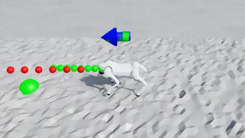](videos/teacher_hurdle_base.mp4) | [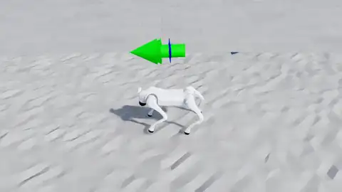](videos/student_hurdle_base.mp4) |
| 中等 | [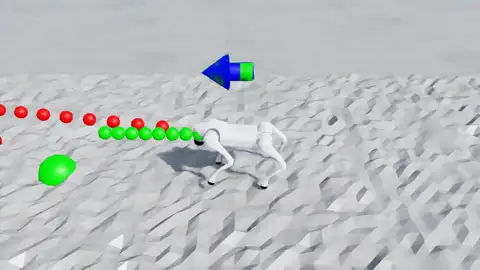](videos/teacher_hurdle_medium.mp4) | [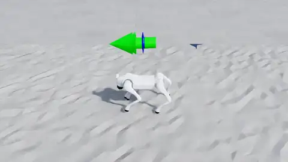](videos/student_hurdle_medium.mp4) |
| 困难 | [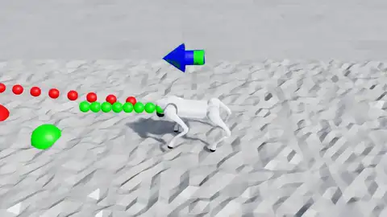](videos/teacher_hurdle_hard.mp4) | [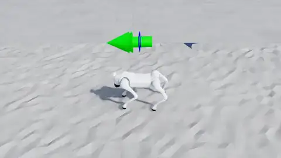](videos/student_hurdle_hard.mp4) |

### 台阶高度与连续台阶数量

| 难度 | Teacher | Student |
|---|---|---|
| 标准 | [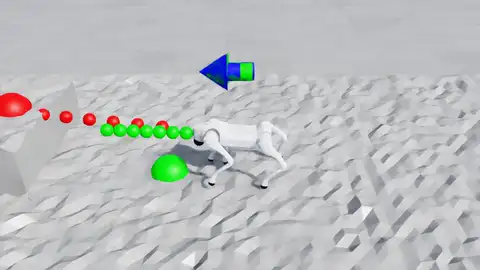](videos/teacher_step_base.mp4) | [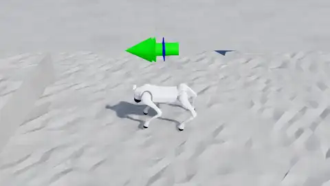](videos/student_step_base.mp4) |
| 中等 | [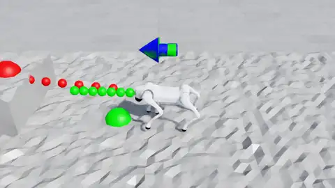](videos/teacher_step_medium.mp4) |  |
| 困难 | [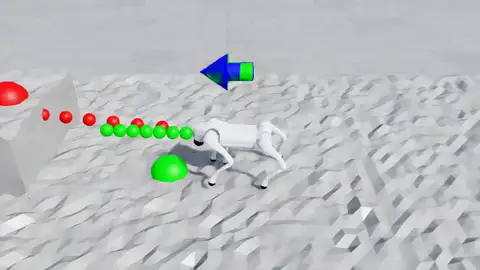](videos/teacher_step_hard.mp4) |  |

### 沟槽宽度

| 难度 | Teacher | Student |
|---|---|---|
| 标准 |  |  |
| 中等 | [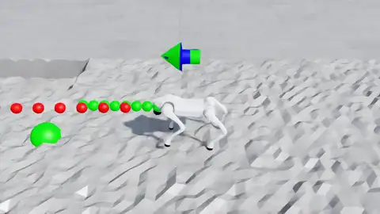](videos/teacher_gap_medium.mp4) | [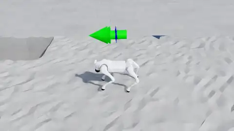](videos/student_gap_medium.mp4) |
| 困难 | [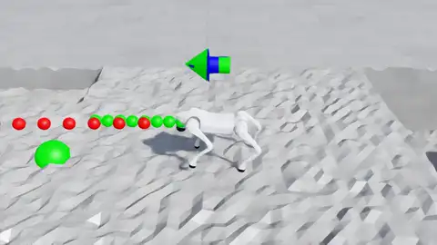](videos/teacher_gap_hard.mp4) | [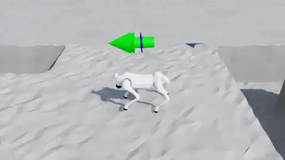](videos/student_gap_hard.mp4) |

### 独木桥宽度

| 难度 | Teacher | Student |
|---|---|---|
| 标准 | [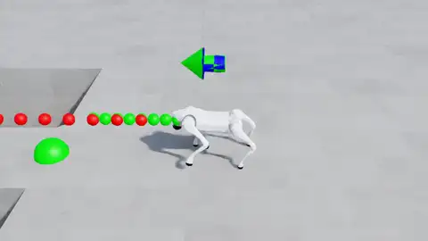](videos/teacher_beam_base.mp4) | [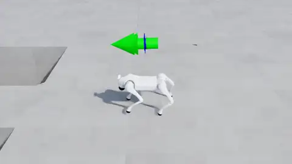](videos/student_beam_base.mp4) |
| 中等 | [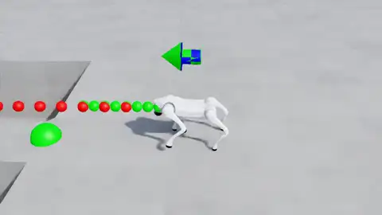](videos/teacher_beam_medium.mp4) | [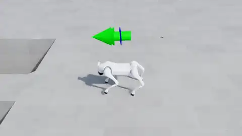](videos/student_beam_medium.mp4) |
| 困难 | [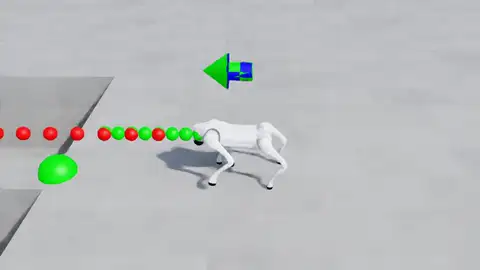](videos/teacher_beam_hard.mp4) |  |

## 结果文件

- `metrics.csv`：24 个有效评测条件的汇总数据
- `full/*.json`：每个条件的完整机器可读指标与参数
- `full/*.log`：每个条件的原始运行日志
- `full/status.log`：后台批处理执行记录
- `videos/*.mp4`：24 个实验条件的 Teacher 与 Student 演示视频
- `videos/previews/*.webp`：可在报告页面直接播放的动画预览
- `videos/status.log`：视频批处理执行记录
